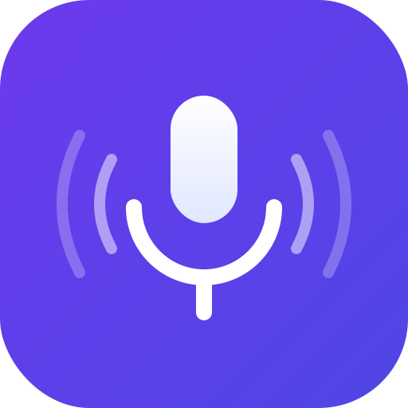

  

<h1 align="center">Dictator</h1>

A lightweight macOS menu bar app that turns your voice into text using OpenAI's Whisper API.

  
  

---

## How It Works

1. **Hold `Ctrl + Escape`** — recording starts, system audio mutes automatically
2. **Speak** — a live audio level bar shows your input in the menu bar popup
3. **Release** — audio is sent to OpenAI Whisper, transcribed, and auto-pasted into whatever app you were using

That's it. The transcription is also saved to history so you can copy it again later.

## Setup

### 1. Build & Run

Open `Dictate.xcodeproj` in Xcode and run the project (`Cmd + R`). The app appears as a microphone icon in your menu bar.

### 2. Grant Permissions

On first launch, Dictate will ask for two permissions:

| Permission | Where | Why |
|---|---|---|
| **Accessibility** | System Settings > Privacy & Security > Accessibility | Global keyboard shortcut |
| **Microphone** | Prompted automatically | Voice recording |

### 3. Add Your OpenAI API Key

Click the menu bar icon, then open **Settings**. Paste your [OpenAI API key](https://platform.openai.com/api-keys) and you're ready to go.

## Settings

| Option | Default | Description |
|---|---|---|
| **API Key** | — | Your OpenAI API key (required) |
| **Language** | auto | Optional language hint (e.g. `en`, `fr`, `de`) for better accuracy |
| **Auto-copy to clipboard** | On | Copies transcription to clipboard automatically |
| **Auto-paste into active input** | On | Simulates `Cmd+V` after transcription |
| **Mute system audio while recording** | On | Temporarily mutes speakers so Whisper doesn't pick up background audio |

## Features

- **Push-to-talk** — hold `Ctrl+Escape` to record, release to stop
- **Auto-paste** — transcribed text is pasted directly into your active app
- **Smart mute** — system audio mutes during recording, restores after
- **Transcription history** — all transcriptions saved locally, viewable from the menu bar
- **Exclusive shortcut** — the shortcut is consumed so it won't trigger in other apps

## Requirements

- macOS 14.0 (Sonoma) or later
- OpenAI API key with access to the Whisper transcription API
- Xcode 16+ to build from source
